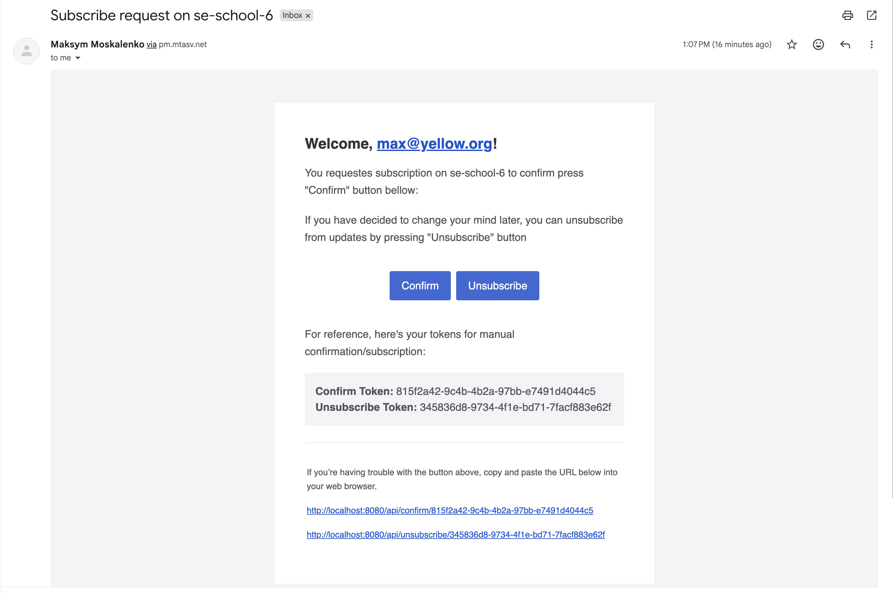
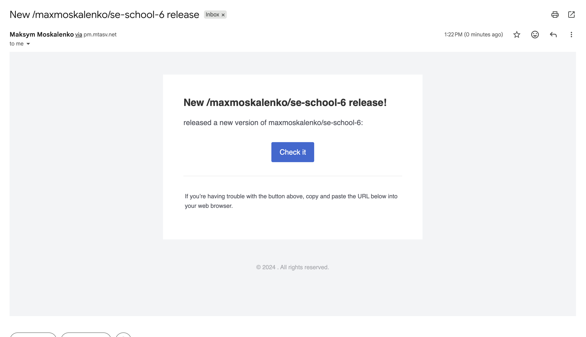

# GitHub Release Notification Service

A monolithic Go service that allows users to subscribe to GitHub repositories and receive email notifications when new releases are published.

## File structure

```
main.go                     -- entrypoint: migrations, DI, runs API server + scanner
internal/
  domain/                   -- entities, repository interface, domain errors
  api/                      -- business logic (subscribe, confirm, unsubscribe, list)
  scanner/                  -- periodic release checker + email notifier
  ginrouter/                -- HTTP handlers (Gin)
  gormrepo/                 -- PostgreSQL repository (GORM)
  mockrepo/                 -- mock repository for unit tests
  config/                   -- env-based configuration
pkg/
  gitsvc/                   -- GitHub API client (go-github)
  mailsvc/                  -- email service (Postmark)
  bindvalidator/            -- custom Gin validators
migrations/postgres/        -- goose SQL migrations
```

### Key design decisions

- **Clean architecture** -- domain layer has no external dependencies; API and scanner depend on interfaces, not implementations.
- **Double opt-in (DOI)** -- each subscription generates a confirm + unsubscribe token pair. Confirmation is required before notifications are sent.
- **Scanner fairness** -- repositories are sorted by `last_checked_at` (nulls first) so newly added repos get checked immediately, and no repo is starved.

## API

| Method | Path                      | Description                 |
| ------ | ------------------------- | --------------------------- |
| POST   | `/api/auth`               | Get a JWT token             |
| POST   | `/api/subscribe`          | Subscribe to a repository   |
| GET    | `/api/confirm/:token`     | Confirm subscription (DOI)  |
| GET    | `/api/unsubscribe/:token` | Unsubscribe from repository |
| GET    | `/api/subscriptions`      | List subscriptions by email |

## Running

### Prerequisites

- Docker & Docker Compose
- A Postmark account with configured email templates
- (Optional) GitHub personal access token for higher API rate limits

### Setup

```bash
cp .env.example .env
# fill in POSTMARK_* and optionally GITHUB_AUTH_TOKEN
```

### Docker

#### Production

```bash
docker build -t release-notifier .
docker run --env-file .env -p 8080:8080 release-notifier
```

#### Local development

```bash
docker compose -f compose/docker-compose.yaml up --build
```

The service starts on port `8080` by default. Database migrations run automatically on startup.
Also note, that docker-compose uses Dockerfile.dev, which mounts the source code as a volume for local development. Changes to the code will trigger a hot reload of the API/scanner server.

## Testing

```bash
go test ./internal/api/ ./internal/scanner/ -v
```

Unit tests cover all API methods and scanner logic using mock implementations of the repository, email service, and GitHub service (testify/mock).

## Configuration

| Variable                                 | Description                                                       | Default                 |
| ---------------------------------------- | ----------------------------------------------------------------- | ----------------------- |
| `API_HOST_URL`                           | Base URL for DOI links in emails                                  | `http://localhost:8080` |
| `API_JWT_SECRET`                         | Secret key for signing/verifying JWT tokens                       |                         |
| `API_VALIDATE_AUTH_EMAIL`                | Validate that JWT email matches request email                     | `false`                 |
| `ROUTER_PORT`                            | HTTP server port                                                  | `8080`                  |
| `DATABASE_HOST`                          | PostgreSQL host                                                   | `localhost`             |
| `DATABASE_PORT`                          | PostgreSQL port                                                   | `5432`                  |
| `DATABASE_USER`                          | PostgreSQL user                                                   | `postgres`              |
| `DATABASE_PASSWORD`                      | PostgreSQL password                                               | `postgres`              |
| `DATABASE_NAME`                          | PostgreSQL database name                                          | `postgres`              |
| `DATABASE_SSL_MODE`                      | PostgreSQL SSL mode                                               | `disable`               |
| `POSTMARK_SERVER_TOKEN`                  | Postmark server API token                                         |                         |
| `POSTMARK_ACCOUNT_TOKEN`                 | Postmark account API token                                        |                         |
| `POSTMARK_SENDER_EMAIL`                  | Sender email address                                              |                         |
| `POSTMARK_SUBSCRIBE_REQUEST_TEMPLATE_ID` | Postmark template for confirmation email                          |                         |
| `POSTMARK_NEW_RELEASE_TEMPLATE_ID`       | Postmark template for release email                               |                         |
| `GITHUB_AUTH_TOKEN`                      | GitHub token (optional, raises rate limit from 60 to 5000 req/hr) |                         |
| `SCANNER_INTERVAL`                       | How often to check for new releases                               | `1h`                    |
| `REDIS_ADDR`                             | Redis server address                                              | `localhost:6379`        |
| `REDIS_PASSWORD`                         | Redis password                                                    |                         |
| `REDIS_DB`                               | Redis database number                                             | `0`                     |
| `REDIS_CACHE_TTL`                        | TTL for cached GitHub API responses                               | `10m`                   |

## What failed to implement

I wasn't able to verify my postmark account to send emails to the external (outside of my working domain) email addresses, but it's working, and here are the screenshots of the emails I've received while testing with my personal email address:




## Authorisation

Authorisation is optional and can be disabled by setting `API_VALIDATE_AUTH_EMAIL=false`. If enabled, the email in the JWT token must match the email in the request (either body or query parameters) for all endpoints except `/api/auth`. This ensures that users can only access their own subscriptions and cannot impersonate others by using a valid JWT with a different email.

To access the API, clients must first obtain a JWT token by sending a POST request to `/api/auth` with their email. The server will generate a token containing the email as a claim and return it in the response. The client must then include this token in the `Authorization` header (as `Bearer <token>`) for all subsequent requests to protected endpoints.

This feature is disabled by default
